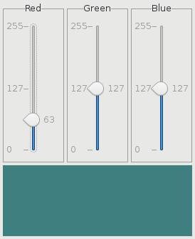
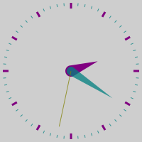
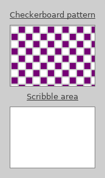

This is a collection of small and unwanted programs based on GTK+3 (https://www.gtk.org).

### window

Bare window, nothing more.

### rgb

RGB color picker.

### clock

Analog clocks.

### scribble

Draggable checkerboard and scribble area.

